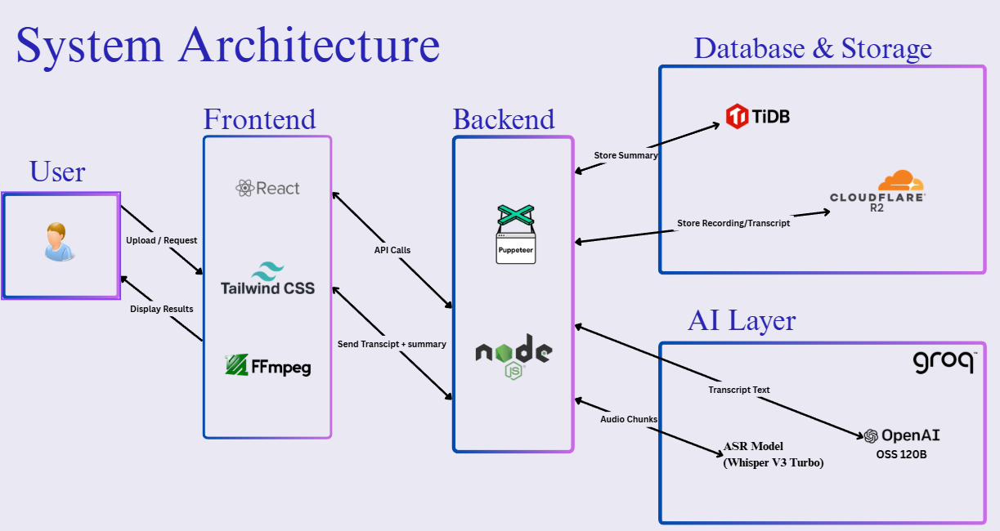
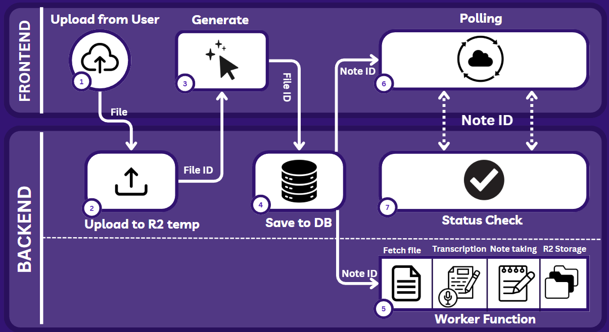
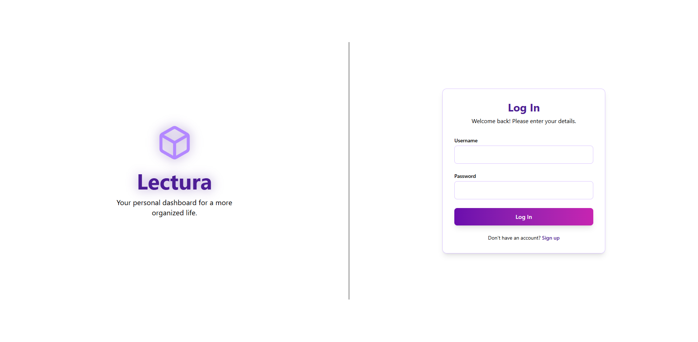
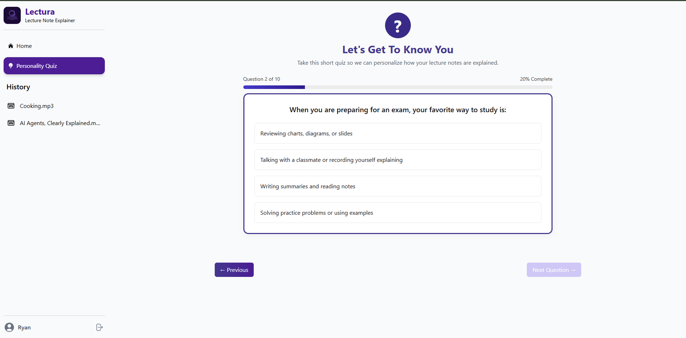
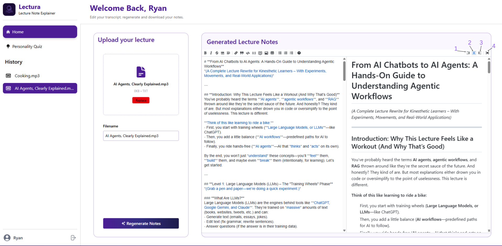
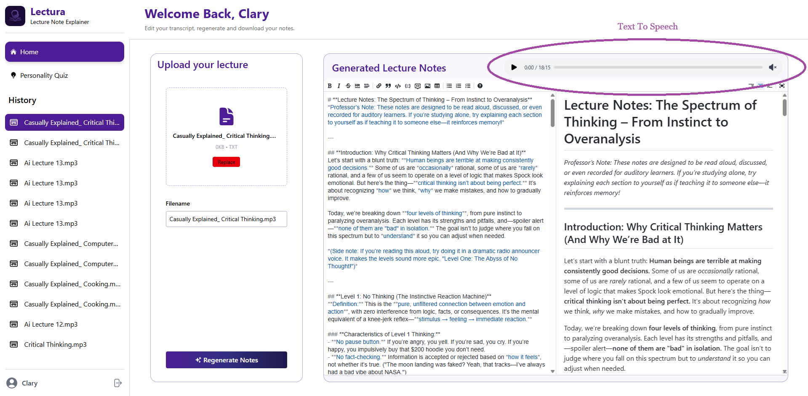

<a id="readme-top"></a>
<!-- 
[![Contributors][contributors-shield]][contributors-url]
[![Forks][forks-shield]][forks-url]
[![Stargazers][stars-shield]][stars-url]
[![Issues][issues-shield]][issues-url]
[![MIT License][license-shield]][license-url] -->


<br />
<div align="center">
  <a href="https://lectura.minpainghein.com/">
    
  </a>

  <h2 align="center">Lectura</h2>

  <p align="center">
    Personalized AI Lecture Notes — <em>Your Lectures, Your Notes, Your Way</em>
    <br />
    <br />
    <a href="https://lectura.minpainghein.com/">🌐 View Demo</a>
    ·
    <a href="https://www.canva.com/design/DAG4-ccTddU/B9ndgyI4aLGgOPuL5rkx7g/view?utm_content=DAG4-ccTddU&utm_campaign=designshare&utm_medium=link2&utm_source=uniquelinks&utlId=h6c3789e9bb">🖼️ View Slides</a>

  </p>
</div>


📑 Table of Contents
  <ol>
    <li>
      <a href="#-about-the-project">About The Project</a>
      <ul>
        <li><a href="#-core-features">Core Features</a></li>
        <li><a href="#-architecture">Application Architecture</a></li>
        <li><a href="#-built-with">Built With</a></li>
      </ul>
    </li>
    <li>
      <a href="#-getting-started">Getting Started</a>
      <ul>
        <li><a href="#-prerequisites">Prerequisites</a></li>
        <li><a href="#-installation">Installation</a></li>
        <li><a href="#-environment-variables">Environment Variables</a></li>
      </ul>
    </li>
    <li><a href="#-usage">Usage</a></li>
    <li><a href="#-screenshots">Screenshots</a></li>
    <li><a href="#-contributors">Contributors</a></li>
    <li><a href="#-acknowledgments">Acknowledgments</a></li>
  </ol>
  
---

## 🧠 About The Project

**Lectura** is an AI-powered platform that transforms recorded lectures into structured, personalized study notes.
It’s built to support **multiple learning styles** using the **VARK framework** (Visual, Auditory, Reading/Writing, Kinesthetic).
Learners can upload a lecture, get instant transcription and summarization in a way that best suits their learning style.


### ✨ Core Features
* 🎥 **Video Upload → Audio Conversion**
* 🗣️ **Whisper Transcription Module**
* 🧾 **Mistral AI Note Summarization**
* 🧾 **Gemini AI Note Summarization**
* 💬 **Markdown Editor (React-MD-Editor + Mermaid)**
* 🔊 **Text-to-Speech for Auditory Learners**
* 🧩 **VARK Questionnaire for Personalization**
  
<p align="right">(<a href="#readme-top">⬆️ Back to Top</a>)</p>

---
### 🧱 Application Architecture

Here is an overview of the project's architecture and data flow.

🏠 System Architecture 

<br/>

🏠 Workflow Diagram 

<br/>

<p align="right">(<a href="#readme-top">⬆️ Back to Top</a>)</p>

---
### 🛠️ Built With

This project was bootstrapped with the following technologies:

* [](https://reactjs.org/)
* [](https://tailwindcss.com/)
* [](https://nodejs.org/)
* [](https://ffmpeg.org/)
* [](https://mistral.ai/)
* [](https://www.cloudflare.com/developer-platform/r2/)
* [](https://gemini.google/)
* [](https://lemonfox.ai)


<p align="right">(<a href="#readme-top">⬆️ Back to Top</a>)</p>

---
## ⚙️ Getting Started

To get a local copy up and running, follow these simple steps.

### 📋 Prerequisites

Ensure you have the following installed on your machine:
* Node.js (v18+)
* npm
* A Database (e.g. PostgreSQL)
* Cloudflare R2 credentials
* API keys for **Whisper**, **Mistral**, **Gemini**, and **Lemonfox**

### Installation

1.  Clone the repository
    ```sh
    git clone [https://github.com/yourusername/lectura.git](https://github.com/yourusername/lectura.git)
    cd lectura
    ```
2.  Install dependencies for both frontend and backend
    ```sh
    # Install backend dependencies
    cd backend && npm install
    
    # Install frontend dependencies
    cd ../frontend && npm install
    ```

<p align="right">(<a href="#readme-top">⬆️ Back to Top</a>)</p>

### 🔐 Environment Variables

Create `.env` files in both the `frontend` and `backend` directories. Then fill in the variables with *your own credentials*.

> [!CAUTION]
> ⚠️ **Never** commit your `.env` files to GitHub. They contain sensitive credentials.

#### 🖥️ `backend/.env`
```env
# Database Configuration
DB_HOST=localhost
DB_PORT=5000
DB_USERNAME=admin
DB_PASSWORD=yourpassword
DB_DATABASE=lectura_db
SECRET_KEY=somesecretkey

# Cloudflare R2 Storage
R2_ACCOUNT_ID=your_id
R2_ACCESS_KEY_ID=your_key
R2_SECRET_ACCESS_KEY=your_secret
R2_BUCKET_NAME=lectura-temp

# API Keys
GROQ_API_KEY=your_key
MISTRAL_API_KEY=your_key
LEMONFOX_API_KEY=your_key
```

🌐 frontend/.env
```
# Code snippet
VITE_API_URL=http://localhost:5000
```
<p align="right">(<a href="#readme-top">⬆️ Back to Top</a>)</p>

▶️ Start the backend server: Navigate to backend (./backend/...) 
<br />
```npm start```
<br />
▶️ Start the frontend server: Navigate to frontend (./frontend/...)
<br />
```npm run dev```
<br />
Visit http://localhost:5173 in your browser.
<br />
> [!IMPORTANT]
> User Flow: Upload a lecture text, mp3 or mp4 file → transcribe → summarize → explore notes → listen via TTS 🎧

---

## 🖼️ Screenshots
> [!NOTE]
> Screenshots of the application with labeled features
## Feature Preview
🏠 Login 

<br />

❓ VARK Questionnaire 

<br />

🧾 Note Generation Page
 1. Only view and edit uploaded text/audio on the left side
 2. Live view of uploaded text/audio and the personalized output
 3. Only view the personalized output
 4. Toggle fullscreen mode
    

<br />

🗣️ Text-to-Speech Output 

<br />

<p align="right">(<a href="#readme-top">⬆️ Back to Top</a>)</p>

---

## 👥 Contributors

<table>
  <tr>
    <td align="center">
      <a href="https://github.com/False10101">
        
        <br />
        <sub><b>Min Paing Hein</b></sub>
      </a>
    </td>
    <td align="center">
      <a href="https://github.com/mamamind47">
        
        <br />
        <sub><b>Badeesorn Sittikong</b></sub>
      </a>
    </td>
    <td align="center">
      <a href="https://github.com/maddiee97">
        
        <br />
        <sub><b>Louise Madison Maganda</b></sub>
      </a>
    </td>
    <td align="center">
      <a href="https://github.com/nypoclary">
        
        <br />
        <sub><b>Ngwe Yee Pearl Ou</b></sub>
      </a>
    </td>
    <td align="center">
      <a href="https://github.com/EatSleepCodeRunTimeErrorRepeat">
        
        <br />
        <sub><b>Ryan Letchman</b></sub>
      </a>
    </td>
  </tr>
</table>

<p align="right">(<a href="#readme-top">⬆️ Back to Top</a>)</p>

---

## 🙇 Acknowledgments

We would like to express our sincere gratitude to the following people and technologies that made this project possible:

### 👩‍🏫 Academic Support
- **Asst. Prof. Dr.Chakarida Nukoolkit** — For guidance, feedback, and continuous support throughout the development of this project.
- **TA. Sukanya Chinwicha** — For providing technical assistance, clarification, and valuable advice during the implementation process.

### 🧰 Technologies & Tools
- OpenAI Whisper — Automatic speech recognition  
- Mistral AI — Text generation and summarization  
- Cloudflare R2 — File storage  
- FFmpeg — Audio processing  
- React Markdown Editor  
- TailwindCSS
- Mermaid npm
- Lemonfox TTS
- GitHub Pages
- Gemini AI — Text generation and summarization  
  
### 👩‍🏫 Peers
- Special thanks to all team members for their dedication and teamwork throughout development.
- Our classmates who provided feedback and tested early versions of the platform.

We are truly grateful for all the help and support we received during this project.

<p align="right">(<a href="#readme-top">⬆️ Back to Top</a>)</p>
